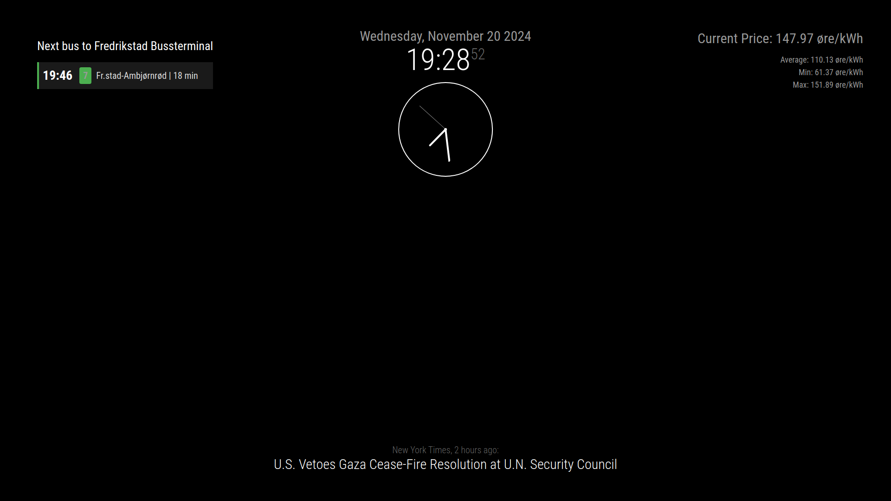

# MMM-BusTimesRuter
A [MagicMirror²](https://github.com/MichMich/MagicMirror) module that displays bus times from the Entur API for Norwegian public transport (Ruter).

## Features
- Displays next bus departures from specified stop
- Shows real-time updates
- Filters for specific destination (supports both full and abbreviated names)
- Updates every minute
- Simple and clean display
- Customizable styling

## Screenshot


## Installation
```bash
cd ~/MagicMirror/modules
git clone https://github.com/trymthoren/MMM-BusTimesRuter.git
cd MMM-BusTimesRuter
npm install
```

## Configuration


Add this configuration to your config/config.js file:

```javascript
{
    module: "MMM-BusTimesRuter",
    position: "top_left",
    config: {
        stopId: "NSR:StopPlace:2408",         // Get your stop ID from stoppested.entur.org
                                             // Example: 2408 = Borgehallen, Fredrikstad
        destination: "Fredrikstad Bussterminal",
        destinationShort: "fr.stad",          // Alternative destination text to match
        numberOfDepartures: 3,
        updateInterval: 60000                  // Update every minute
    }
}
```
## Configuration Options

| Option | Description | Default Value |
|--------|-------------|---------------|
| `stopId` | Entur StopPlace ID | Required |
| `destination` | Destination to filter for | Required |
| `destinationShort` | Alternative/short form of destination | Optional |
| `numberOfDepartures` | Number of departures to show | 3 |
| `updateInterval` | Update frequency in milliseconds | 60000 |

## How It Works
The module will show buses where the destination matches either:

The full destination name (e.g., "Fredrikstad Bussterminal")
The short destination name (e.g., "fr.stad")

This allows for flexible matching of destinations that might appear differently in the API response.
Finding Stop IDs
You can find stop IDs by searching on Entur's Stop Place Register.

## Styling
The module includes a default style that matches the MagicMirror theme. You can customize the appearance by modifying the MMM-BusTimesRuter.css file.
Dependencies

Uses Entur's Journey Planner API v3
No API key required
Automatically handles API authentication

## Attribution
This module uses data from Entur, Norway's National Journey Planner.
Updates

Now uses Journey Planner API v3
Added flexible destination matching
Improved error handling and logging

## License
MIT License
